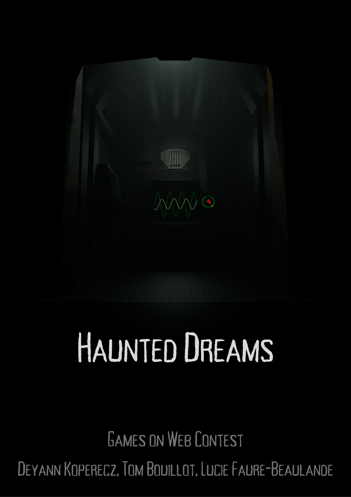

# haunteddreams-gameonweb-contest-24-25


## Technos
**Vue :** 
```
npm i -g @vue/cli
```
**Babylon.js :**
```
npm i @babylonjs/core 
npm i @babylonjs/loaders
```

## Project setup
```
npm install
```

### Compiles and hot-reloads for development
```
npm run serve
```

### Compiles and minifies for production
```
npm run build
```

### Lints and fixes files
```
npm run lint
```

### Customize configuration
See [Configuration Reference](https://cli.vuejs.org/config/).
