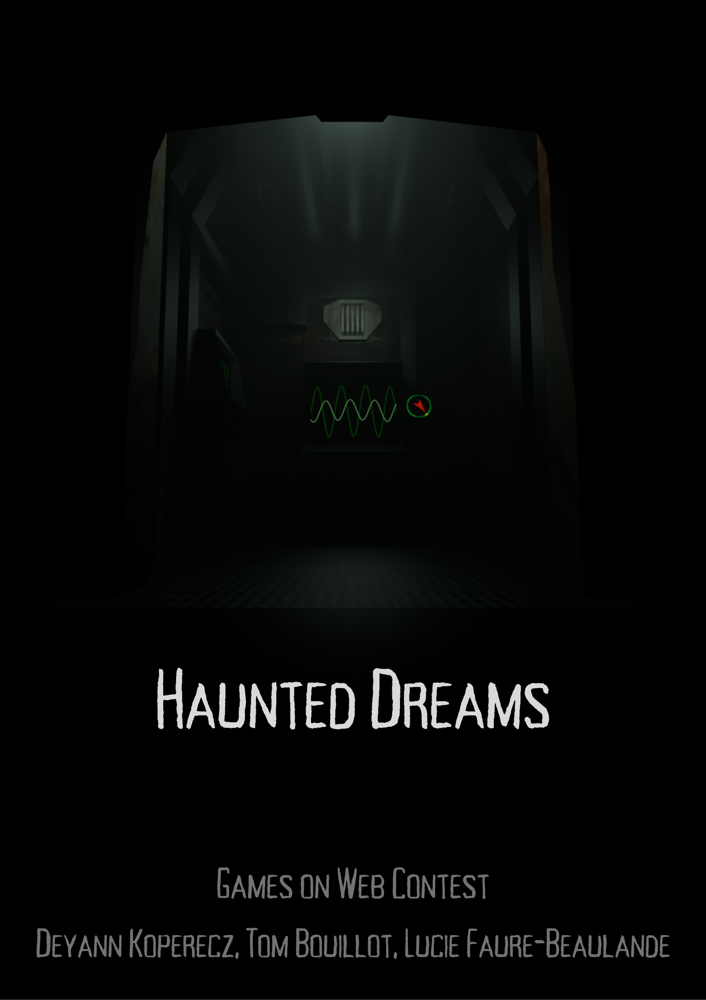

# haunteddreams-gameonweb-contest-24-25


HauntedDream est un jeu d'enquête angoissant et immersif, où vous incarnez un condamné à mort recruté par le mystérieux psychiatre Dunwich. Votre mission : explorer l’esprit brisé d’une patiente internée pour percer le secret qui la hante.

Plongez dans une réalité alternative de 1945, où la science a ouvert les portes du subconscient. Grâce à une technologie révolutionnaire, vous serez projeté au cœur des cauchemars de cette âme tourmentée. Mais attention, ce voyage est aussi périlleux qu’insondable. Chaque choix compte, chaque découverte vous rapproche de la vérité… ou de la folie.

Obéissez aux exigences du docteur, extirpez-lui les informations qu’il cherche et peut-être, juste peut-être, échapperez-vous à votre funeste destinée. Oserez-vous défier l’horreur alors encore inexplorée, au prix de votre liberté ?

[Voir le trailer sur YouTube](https://www.youtube.com/watch?v=PME4RAuYcyg)

Ce jeu est en cours de développement dans le cadre du concours [Games On Web 2025](https://www.cgi.com/france/fr-fr/event/games-on-web-2025) organisé par [CGI France](https://www.cgi.com/france/fr-fr). 


### Initialisation
**Vue :** 
```
npm i -g @vue/cli
```
**Babylon.js :**
```
npm i @babylonjs/core 
npm i @babylonjs/loaders
npm i @babylonjs/gui
```
Project setup
```
npm install
```
Compiles and hot-reloads for development
```
npm run serve
```


# 🧠 Haunted Dream — Guide de Démarrage

**Haunted Dream** est un jeu narratif dans lequel vous incarnez un explorateur de l’esprit, plongé dans les rêves d’un patient en détresse.  
Votre mission : **localiser et neutraliser l’origine de ses cauchemars** afin de le guérir.

---

## 🎮 Contexte du jeu

Vous êtes à bord d’un vaisseau unique, conçu pour voyager à travers les rêves.  
Ce que vous voyez, entendez ou ressentez provient exclusivement de l’esprit du patient : l’extérieur vous est totalement inaccessible.

---

## 🧩 Objectif

Votre objectif est de :
- Explorer les cauchemars du patient ;
- Identifier leur fréquence ;
- Naviguer à l’aide de votre boussole jusqu’à ces fréquences ;
- Capturer les cauchemars en photo pour progresser dans l’histoire.

⚠️ **Attention** : une mauvaise navigation peut avoir des conséquences négatives sur votre progression ou sur l’état mental du patient.

---

## 🗂️ Ressources à votre disposition

Pour vous orienter, vous aurez accès à plusieurs documents :
- Le **journal intime d’Elisa**, la patiente ;
- Les **notes d’exploration de l’équipe précédente** ;
- Des **documents médicaux fournis par le docteur**.

Ces éléments vous permettront de récolter les informations nécessaires pour déterminer les fréquences à atteindre.

---

*Bonne exploration, et faites preuve de discernement dans l’univers des rêves...*
