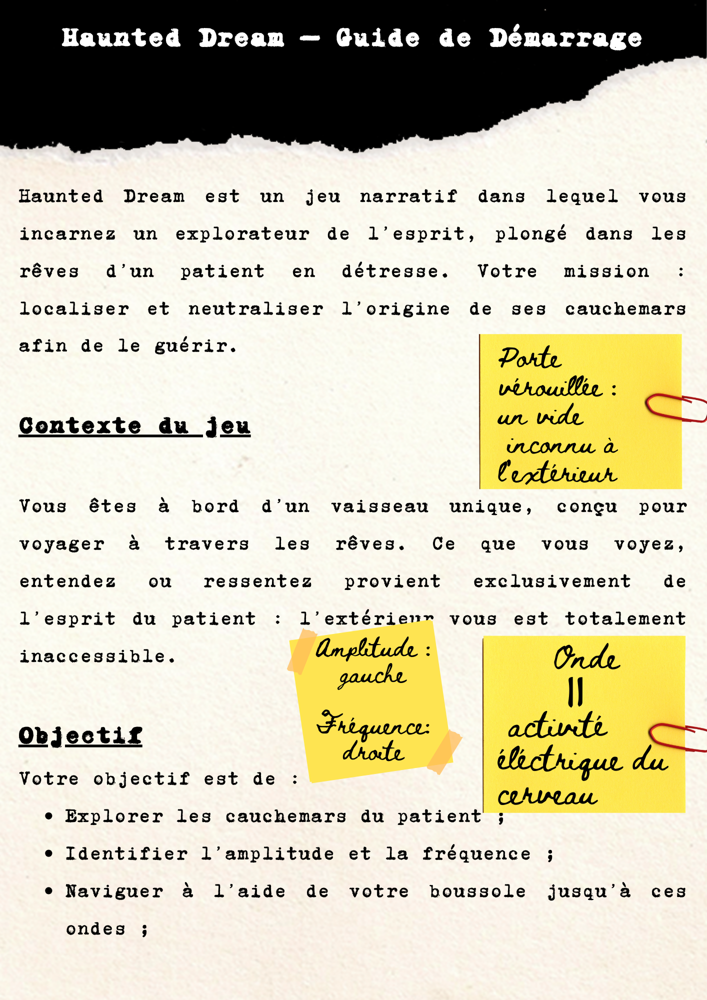
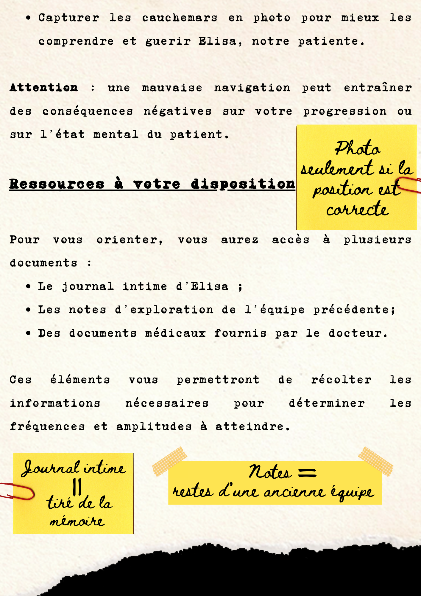

<div align="center">
  <a href="#readme">
    
  </a>
  <a href="#installation">
    
  </a>
  <a href="#comment-jouer">
    
  </a>
  <a href="#lore">
    
  </a>
  <a href="#enigmes">
    
  </a>
</div>

---

<a name="readme"></a>
# Haunted Dreams


HauntedDream est un jeu d'enquête angoissant et immersif, où vous incarnez un condamné à mort recruté par le mystérieux psychiatre Dunwich. Votre mission : explorer l'esprit brisé d'une patiente internée pour percer le secret qui la hante.

Plongez dans une réalité alternative de 1945, où la science a ouvert les portes du subconscient. Grâce à une technologie révolutionnaire, vous serez projeté au cœur des cauchemars de cette âme tourmentée. Mais attention, ce voyage est aussi périlleux qu'insondable. Chaque choix compte, chaque découverte vous rapproche de la vérité… ou de la folie.

Obéissez aux exigences du docteur, extirpez-lui les informations qu'il cherche et peut-être, juste peut-être, échapperez-vous à votre funeste destinée. Oserez-vous défier l'horreur alors encore inexplorée, au prix de votre liberté ?

[Voir le trailer sur YouTube](https://www.youtube.com/watch?v=PME4RAuYcyg)

Ce jeu est développé dans le cadre du concours [Games On Web 2025](https://www.cgi.com/france/fr-fr/event/games-on-web-2025) organisé par [CGI France](https://www.cgi.com/france/fr-fr).

Consulter notre [repo Github]().

---

<a name="installation"></a>
# Installation

**Vue :**
```
npm i -g @vue/cli
```
**Babylon.js :**
```
npm i @babylonjs/core
npm i @babylonjs/loaders
npm i @babylonjs/gui
```
**Project setup :**
```
npm install
```
**Compiles and hot-reloads for development :**
```
npm run serve
```
---

<a name="comment-jouer"></a>
# Comment jouer ?




---

<a name="lore"></a>
# Explication du lore


---

<a name="enigmes"></a>
# Solution des énigmes

*Contenu des solutions des énigmes...*